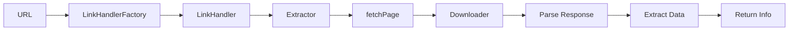

NewPipe Extractor is built on a modular, service-oriented architecture that enables extraction of data from multiple streaming platforms through a unified interface.

## Core Architecture

The library follows a layered architecture with three main components:

<CardGroup cols={3}>
  <Card title="Services" icon="server">
    Service implementations for each platform (YouTube, SoundCloud, etc.)
  </Card>
  <Card title="Extractors" icon="download">
    Data extraction logic for different content types
  </Card>
  <Card title="Link Handlers" icon="link">
    URL parsing and ID extraction utilities
  </Card>
</CardGroup>

## Design Principles

### Service Abstraction

Each streaming platform is represented by a `StreamingService` implementation that defines:

- Available content types (streams, channels, playlists)
- Link handler factories for URL processing
- Extractor factories for data extraction
- Supported localizations and content countries

### Factory Pattern

The library extensively uses the Factory pattern to create:

- **Link Handlers**: Parse URLs and extract IDs
- **Extractors**: Fetch and parse content data
- **Kiosks**: Trending/featured content sections

### Lazy Loading

Extractors implement a two-phase loading pattern:

1. **Initialization**: Create extractor with URL/ID
2. **Fetch**: Call `fetchPage()` to download and parse data

```java
StreamExtractor extractor = service.getStreamExtractor(url);
extractor.fetchPage();
String title = extractor.getName();
```

## Entry Point

The `NewPipe` class serves as the main entry point:

```java
public static void init(Downloader d, Localization l, ContentCountry c)
public static StreamingService getService(int serviceId)
public static StreamingService getServiceByUrl(String url)
```

<Note>
You must call `NewPipe.init()` before using any extractor functionality. This initializes the downloader and localization settings.
</Note>

## Initialization Example

```java
import org.schabi.newpipe.extractor.NewPipe;
import org.schabi.newpipe.extractor.localization.Localization;
import org.schabi.newpipe.extractor.localization.ContentCountry;

// Initialize with custom downloader
NewPipe.init(new MyDownloader());

// Or with localization settings
Localization localization = new Localization("en", "GB");
ContentCountry country = new ContentCountry("US");
NewPipe.init(downloader, localization, country);
```

## Service Discovery

The library automatically detects which service can handle a URL:

```java
// Get service by URL
StreamingService service = NewPipe.getServiceByUrl(
    "https://www.youtube.com/watch?v=dQw4w9WgXcQ"
);

// Get service by ID
StreamingService youtube = NewPipe.getService(0);

// Get service by name
StreamingService soundcloud = NewPipe.getService("SoundCloud");
```

## Content Types

The library supports multiple content types:

<Tabs>
  <Tab title="Streams">
    Video or audio streams (individual content items)
    
    **Extractor**: `StreamExtractor`
    
    **Link Handler**: `LinkHandler`
  </Tab>
  <Tab title="Channels">
    Content creator channels with multiple tabs
    
    **Extractor**: `ChannelExtractor`, `ChannelTabExtractor`
    
    **Link Handler**: `ListLinkHandler`
  </Tab>
  <Tab title="Playlists">
    User-created or auto-generated playlists
    
    **Extractor**: `PlaylistExtractor`
    
    **Link Handler**: `ListLinkHandler`
  </Tab>
  <Tab title="Search">
    Search results with filters
    
    **Extractor**: `SearchExtractor`
    
    **Link Handler**: `SearchQueryHandler`
  </Tab>
  <Tab title="Comments">
    Comment threads and replies
    
    **Extractor**: `CommentsExtractor`
    
    **Link Handler**: `ListLinkHandler`
  </Tab>
  <Tab title="Kiosks">
    Featured/trending content sections
    
    **Extractor**: `KioskExtractor`
    
    **Link Handler**: `ListLinkHandler`
  </Tab>
</Tabs>

## Data Flow



1. **URL Input**: User provides a URL or ID
2. **Link Handler Creation**: Factory parses URL and creates LinkHandler
3. **Extractor Creation**: Service creates appropriate extractor
4. **Page Fetch**: Extractor downloads content via Downloader
5. **Data Parsing**: Extractor parses HTML/JSON response
6. **Data Access**: Client calls getter methods for specific data

## Error Handling

The library uses specific exceptions for different error cases:

- `ParsingException`: Failed to parse data from response
- `ExtractionException`: General extraction errors
- `ContentNotAvailableException`: Content is blocked or removed
- `ContentNotSupportedException`: Feature not supported by service

```java
try {
    StreamExtractor extractor = service.getStreamExtractor(url);
    extractor.fetchPage();
    String title = extractor.getName();
} catch (ParsingException e) {
    // Handle parsing errors
} catch (ExtractionException e) {
    // Handle extraction errors
}
```

## Thread Safety

<Warning>
Extractor instances are **not thread-safe**. Create separate extractor instances for concurrent operations.
</Warning>

## Next Steps

<CardGroup cols={2}>
  <Card title="Services" icon="server" href="/core-concepts/services">
    Learn about StreamingService implementations
  </Card>
  <Card title="Extractors" icon="download" href="/core-concepts/extractors">
    Understand the Extractor pattern
  </Card>
  <Card title="Link Handlers" icon="link" href="/core-concepts/link-handlers">
    Master URL parsing and validation
  </Card>
  <Card title="Localization" icon="globe" href="/core-concepts/localization">
    Configure language and region settings
  </Card>
</CardGroup>